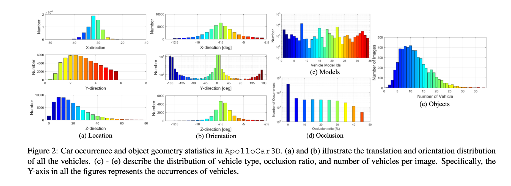
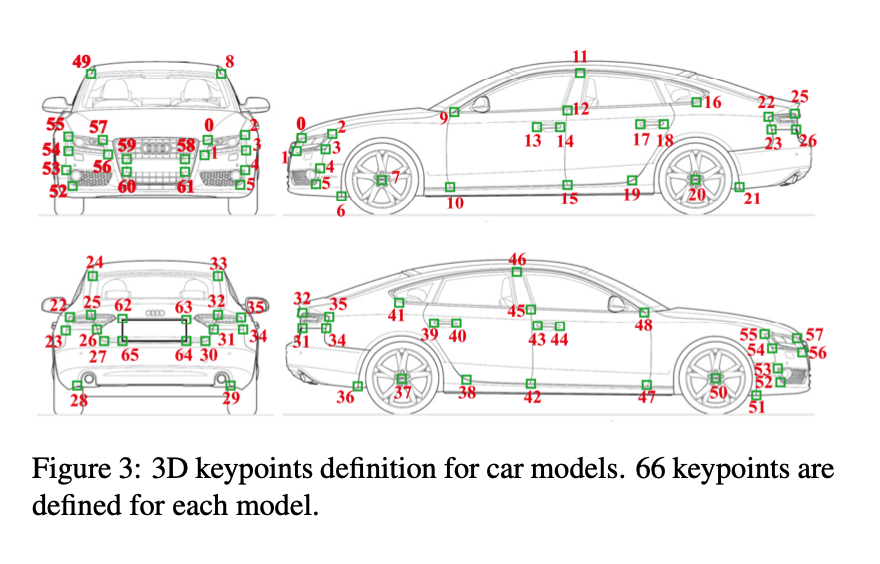
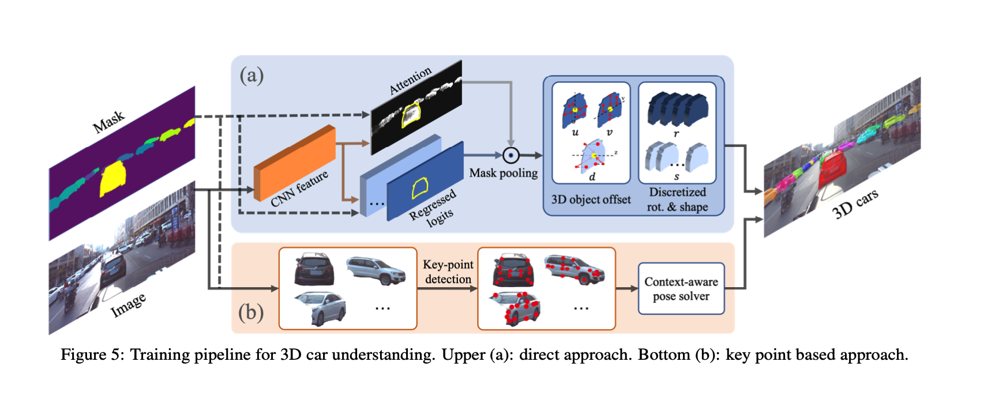

# ApolloCar3D: A Large 3D Car Instance Understanding Benchmark for Autonomous Driving
* 介绍
    * 从图像中理解物体的3D特性，例如3D姿态和形状
    * 当前方法都依赖于lidar，但是lidar有很多缺点
        * 前视覆盖度差，特别是远处和absorbing region
* 数据集
    * 数据获取
        * 图像从ApolloScape中获取，高分辨率 3384 * 2710，>140k 带语义标注，复杂驾驶环境
        * 从4个不同的城市选取标注视频，选取标准：
            * 相对复杂的环境
            * 相邻帧间隔>=10
            * 使用了数据集原本的语义标注进行选取后，又手工筛选，为了在车的尺寸，形状，方向还有车之间互相遮挡都保持多样性，最终选取了5277张图片
        * 3D车模型
            * 高精确度的车模型要求：反投之后的mask和手工标注的mask平均误差3像素，shapenet无法满足，因此让人工标注员根据给定车型的形状和尺寸进行建模，最后共获取34个真实模型，包括：轿车，轿跑，小货车，suv，mpv
            
    * 数据统计信息
        
        * 方向：大部分车前后向开
        * 轿车最多
        * 大部分图片有多于10个标注出的车
    * context-aware 3d 关键点标注
        
        * 借助于高质量3D模型，开发了一个高效的机器辅助的半自动关键点标注过程，只要求标注员在图像中点击一组预设的关键点，之后使用EPnP算法通过反投影自动重建3d实例的pose和模型。使用ransac来处理异常点和错误标注
        * 解EPnP只需要少数关键点，这里定义了66个关键点，冗余度保证了更准确和鲁棒的形状姿态配准
        * 遮挡严重的时候，RANSAC会失效。这里提出一个环境感知的标注过程，加入了车与车之间co-planar的限制，这样可以在相邻的车之间propagate信息，可以同时解这一区域多辆车的信息
        * 优化目标： 所有车辆的 PnP 和 背景感知共面约束
        * $B(K_c)$ 代表当前车是否需要borrow pose from 邻居车，条件为：标注出来的关键点大于6并且同时标注的关键点同时在多于车的两个表面（前左后右，table 2）
        * 标注的关键点的平均值的距离被用来找neighbour，最多使用2个neighbour
        * 实现优化有密集关键点标注的车，通过exhausting所有车种类的方式。要求平均重投影误差小于5个像素并且重投影便捷小于5个像素。当有多个车匹配上的时候，选取投影误差最小的那个。然后再优化关键点相对少的车，通过邻居车辆提供背景信息。当大多数车都aligned之后，再让人类标注员进行视觉上的验证和结果调整

* 两个基线算法
    * 现有工作
        * CarFusion: Combining Point Tracking and Part Detection for Dynamic 3D Reconstruction of Vehicles
        * addressing 3d instance understanding from a single image in an uncontrolled environment is ill-posed
        * 3D-RCNN,直接法，不依赖关键点，依赖2d mask作为输入
        * DeepMANTA 依赖关键点
    * 直接法
        
        * 3D-RCNN，使用ROI pooling 从全卷积特征提取器中crop出每个car instance对应的feature，然后接一个全连接层预测2d amodal center，allocentric rotation and PCA-based shape parameters. 使用同样的策略，旋转和形状的回归输出空间都是离散的。然而，对于深度估计，这里使用了深度真值作为监督，而不是像3D-RCNN里面一样通过amodal box并枚举深度来让投影的mask 去 match box。因此这里把非模态box回归替换成深度回归，使用类似（Deep ordinal regression network for monocular depth estimation）的深度离散策略来给出深度估算的SOTA结果
        * 为了获取detailed shape understanding, 在原来pipeline基础上又做了两个改进：
            1. 3d 形状姿态估计对畸变敏感，roi相当于是对车instance做perspective distortion，所以这里把ROI pooling替换成全卷积结构，并做像素级的pose和shape的回归，简单但更高效。然后使用self attention对一个instance mask内部所有的预测进行特征选择。这里把feature aggregation叫作mask pooling因为这一步为每一个mask选取最重要的信息
            2. 对于估算车辆translation，即amodal center和深度，使用每一个像素针对车辆3d中心的offset而不是对每一个像素使用same target，这样提供更强的监督并使网络更鲁棒
        
    * 关键点法
        * 当关键点足够的时候，基于DeepMANTA的一种方法
        * 使用SOTA 2d关键点检测算法CPM，之前是用于人体姿态估计，这里实验结果也不错
        * 2d 关键点法相比于直接法的优势是，不需要回归全局深度或者scale，通常这些预测都不太可靠。输入到图像中的是cropped image而非全图
        * 首先使用EPnP 解决easy case（关键点多的时候），然后将信息propagate到邻居车直到所有的车pose和shape互相都一致，这种有co-planar限制的车位姿估计算法这里命名为 car pose solver

* 实验
    * 实验细节：
        * 4036 train 200 validation 1041 testing
        * 复现了 3D-RCNN和DeepMANTA
        * 使用了图森复现的MaskRCNN
        * 使用了 DeepLabv3 with Xception65提取出全卷积特征
        * DeepMANTA 使用了 CPM进行关键点预测
        * 4036 training images 中含有40000 标注2d特征点的车辆，用来训练CPM (5 stages of CPM and VGG-16 初始化)
    * 评价指标
        * AP 对于box级别的衡量不够精细
        * 3d bounding box IOU with orientation (average orientation similarity  AOS)
        * 2D bounding box with viewpoint (average viewpoint precision AVP)
        * mesh distance and voxel IOU 通常用来评价3d形状重建
        * we consider comparing projection masks of two models following the idea of visual hull representation
        * 选取了yaw角100个朝向，然后将model投影到1280*1280的图像上面，使用所有view的 mean IOU作为车形状相似度度量。
        * 使用 metrics commonly used by camera pose estimation 作为rotation and translation的度量，
        * 只evaluate 100m以内的车，因为他们更和自动驾驶任务相关
    * 量化结果
        * 使用Mask Pooling代替roi pooling，和offset flow带来很多效果提升，避免了常规roi pooling带来的几何形变
        * DeepMANTA：检测关键点，然后使用PnP对每一辆车求解。使用GT MASK替代 MASKRCNN的输出性能降的很少，证明了MASK RCNN性能很好
        * 让人对val set进行了一次标注，结果明显好于算法，但是人为标注结果也不令人满意，主要原因是标注员无法记住所有66个关键点的语义，导致解出来的pose是错的，这一步可以通过rechecking来提升效果
        * 关键点检测：先抠图，然后用CPM训练，pixel distance 在10以内就认为是true positive, detection rate 75.41%， 平均像素误差在4.39，人标注的detection rate 92.40%, 平均像素误差2.67px
    * 定性实验结果
        * 有额外关键点信息的方法比直接法结果更精确，实际上，对于直接法，大部分错误来自于深度估计，从2d外观来直接估计3d深度特征这个问题是ill-posed and error-prone的，然后，因为使用了可靠的mask，该方法比关键点法找到了更多的车
        * 关键点法非常依赖关键点的检测准确度，一旦关键点检测的很好，car pose估计的也很好，反之亦然
    * 结果分析
        * 非遮挡的车结果反而最差，是因为这些车通常在远距离，尺寸也小
    
